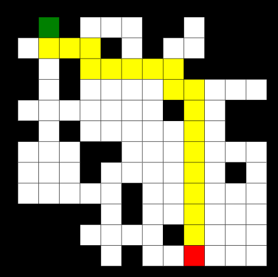

# A-star

Simple usage of A\* pathfinding algorigthm  
[Demo](https://arickcodeguy.github.io/a-star/)  


## Table of Contents

- [Getting started](#getting-started)
- [Versions](#versions)
- [Algoritghm implementation](#algorithm-implementation)
- [Deploy](#deploy)

## Getting started

```cmd
pnpm i
pnpm dev
```

## Versions

- Node - v18.13.0
- pnpm - 8.15.3

## Algoritghm implementation

2 main pathfinding algos can be found here  
[src/utils/pathfinding](https://github.com/ArickCodeGuy/a-star/tree/main/src/utils/pathfinding)

Straightforward implementation from this source  
[youtube](https://youtu.be/-L-WgKMFuhE?si=_ZsYx9AYUWEygBe6)

## Deploy

Deployed using npm `gh-pages`

```cmd
npm run deploy
```
